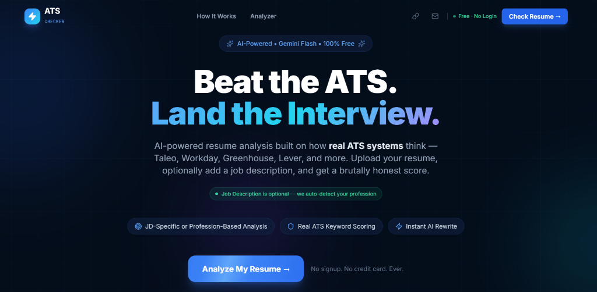
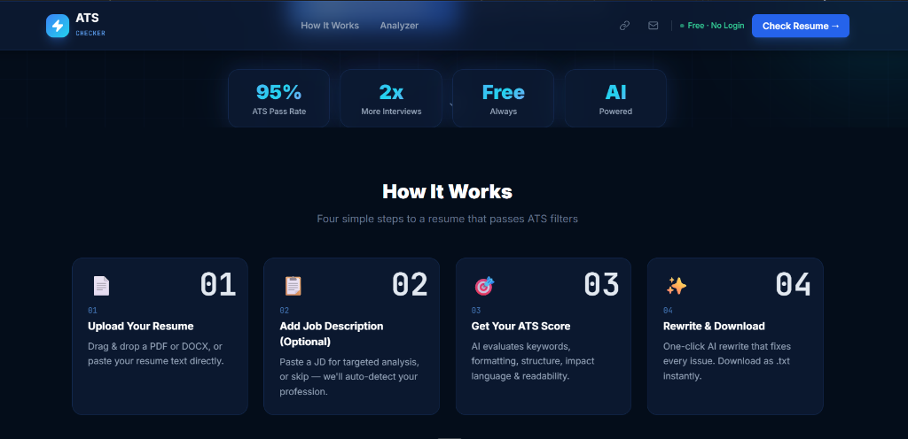
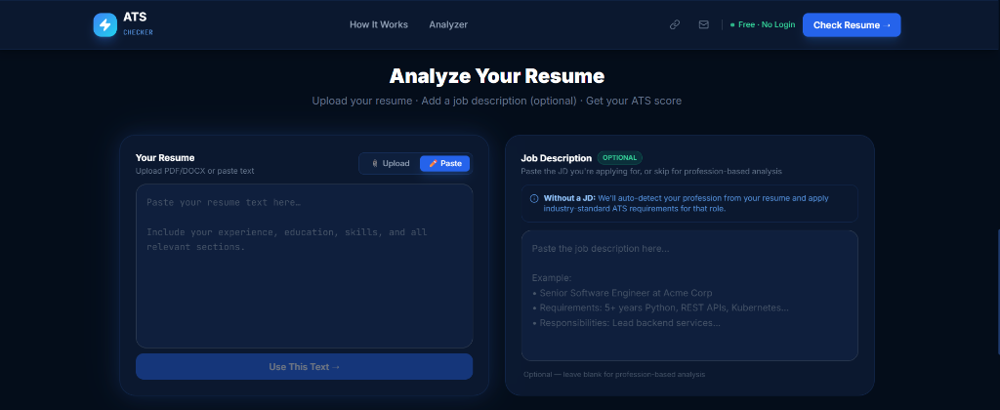
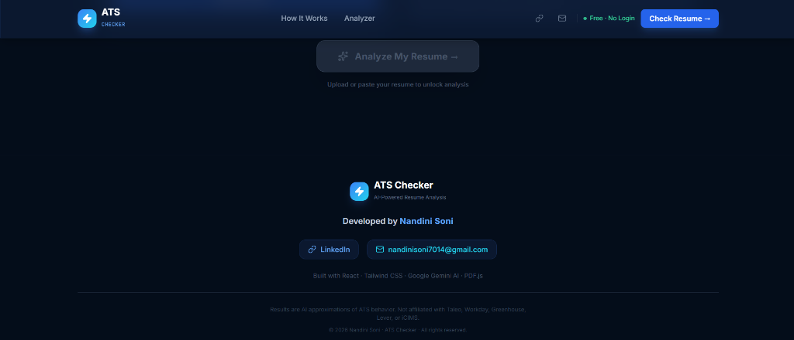

# ATS Resume Checker

AI-powered ATS Resume Checker and Rewriter — built with React + Vite + Tailwind CSS using **Google Gemini** (free tier).

## Previews

<div align="center">
  
  <br />
  
  <br />
  
  <br />
  
</div>

## Features

- 📄 **Upload PDF or DOCX** — client-side parsing, no data sent to any server
- ✏️ **Paste resume text** directly as an alternative
- 📋 **Job Description is OPTIONAL** — without one, AI auto-detects your profession
- 🎯 **ATS Score Dashboard** — 5-category breakdown with animated bars
- 🔑 **Keyword Analysis** — matched (green) vs missing (red) keyword chips
- 💥 **Impact Language Review** — weak bullets flagged for improvement
- ⚠️ **ATS Compatibility Warnings** — formatting issues that break ATS parsing
- ✨ **AI Resume Rewriter** — one-click rewrite with side-by-side comparison
- 📥 **Download & Copy** — export rewritten resume as .txt

## Tech Stack

- **Frontend**: React + Vite + Tailwind CSS v3
- **AI**: Google Gemini (gemini-2.5-flash, free tier)
- **PDF Parsing**: pdfjs-dist (client-side)
- **DOCX Parsing**: mammoth (client-side)
- **Animations**: Framer Motion

## Setup

### 1. Get a free Gemini API key
Go to [https://aistudio.google.com/apikey](https://aistudio.google.com/apikey) and create a free key.

### 2. Configure environment
```bash
cp .env.example .env
# Edit .env and replace your_gemini_api_key_here with your actual key
```

### 3. Install and run
```bash
npm install
npm run dev
```

Open [http://localhost:5173](http://localhost:5173)

## Environment Variables

| Variable | Description |
|---|---|
| `VITE_GEMINI_API_KEY` | Your Google Gemini API key (free at aistudio.google.com) |

## How Analysis Works

1. **With JD**: AI compares resume keywords, structure, and formatting against the specific job description
2. **Without JD**: AI detects the candidate's profession from their resume and applies industry-standard ATS criteria for that role

All scoring comes from the AI — nothing is hardcoded.

## Disclaimer

Results are AI approximations of ATS behavior. Not affiliated with Taleo, Workday, Greenhouse, Lever, or iCIMS.
